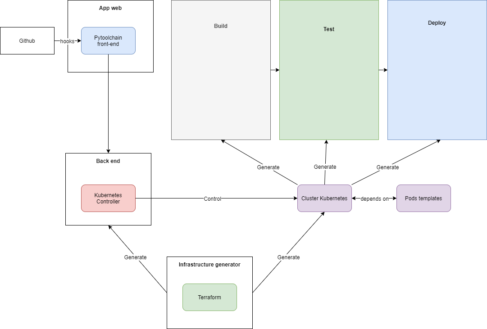

# pytoolchain
a tool to build, validate and deploy python code to cloud providers



## To store secrets

For create_react_app vars, create a .env.development file, and add your variable like this:
```
REACT_APP_YOUR_VAR=SOMETHING
```
